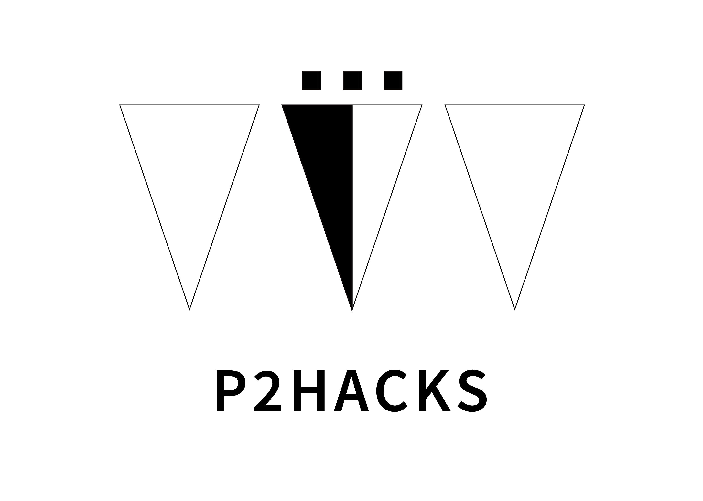

# プロダクト名

## 製品概要
### コンセプト
一言で　例．オープンスペース・オープンマインド

### 背景（製品開発のきっかけ、課題等）
ほげほげ

### 製品説明（具体的な製品の説明）

### 特長

#### 1つ目 
ほげほげ

#### 2つ目
ほげほげ

#### Nつ目  
ほげほげ

### 解決出来ること
ほげほげ

### 今後の展望
- ほげほげ
- ほげほげ

## 開発内容・開発技術
### 活用した技術
#### 言語
- ほげほげ
- ほげほげ

#### フレームワーク・ライブラリ・モジュール（使っていれば）
- ほげほげ
- ほげほげ

#### デバイス（使っていれば）
- ほげほげ
- ほげほげ

## メンバーの役割
- 未来 太郎：フロントエンドとかxx画面とか、読む人に伝わるように
- 未来 二郎：バックエンドとかArduinoとか、わかりやすく
- 未来 花子：デザイン（アプリロゴ）とか、とにかくやったことを書いてください

## 今回のハッカソンで得たこと（学び）
- こういうこと難しかったなぁとか
- はじめこうだったけど、こうしたら良くなったとか
- 書き方は別に箇条書きじゃなくても良いです
